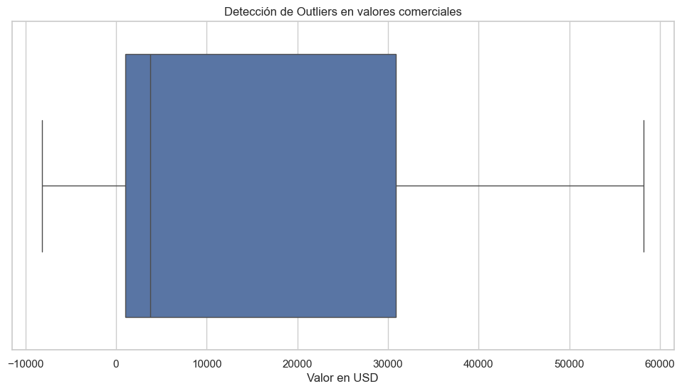

# 📊 Análisis "Mexico Trade Statistics 2012 - 2023"
---

## 📚 Tabla de Contenidos

- [🎯 Propósito](#-propósito)
- [📦 Conjunto de Datos](#-conjunto-de-datos)
- [🧪 Desarrollo del Proyecto](#-desarrollo-del-proyecto)
- [🛠️ Tecnologías](#️-tecnologías)
- [⚙️ Instalación](#️-instalación)
- [📈 Conclusiones y Recomendaciones](#conclusiones-y-recomendaciones)
- [👤 Autor](#-autor)
- [📝 Licencia](#-licencia)

---

## 🎯 Propósito

Analizar la evolución del comercio exterior de México entre 2012 y 2023, identificando los principales socios comerciales, productos clave, tendencias de exportación e importación, y patrones económicos relevantes mediante técnicas de análisis de datos.

---

## 📦 Conjunto de Datos

El conjunto de datos utilizado contiene las siguientes columnas:

- `prod_est`: Nombre de la institución responsable de la recopilación de datos.
- `coverage`: Área geográfica a la que se refieren los indicadores estadísticos.
- `type`: Tipo de operación comercial.
- `year`: Año.
- `month`: Mes numérico.
- `concept`: Descripción de los principales agregados de la información.
- `value_usd`: Valor de venta en millones de dólares estadounidenses, valorado en base FOB o CIF.
- `status`: Estado de las cifras según los lineamientos del INEGI.

Fuente: https://www.kaggle.com/datasets/elanderos/mexico-trade-statistics-2012-2023?select=mex_trade_2022.csv.

---

## 🧪 Desarrollo del Proyecto

### **Carga y exploración inicial de los datos**
El análisis del comercio exterior de México, abarcando el período 2012-2023, se inició con la adquisición de los conjuntos de datos de "Official Mexico Trade Statistics (2012-2023)" de Kaggle, publicados por ***e_landeros***. La primera etapa se centró en un análisis exploratorio preliminar (EDA) con el objetivo de comprender la estructura, volumen, variables y la calidad de los datos, incluyendo la identificación de valores nulos, duplicados e inconsistencias.

Como primer paso, se analizó la cantidad de filas y columnas de cada conjunto de datos:
```bash
Filas y columnas de DatFrame df_2012_2020
Filas: 1944
Columnas: 8

Filas y columnas de DatFrame df_2021
Filas: 216
Columnas: 8

Filas y columnas de DatFrame df_2022
Filas: 216
Columnas: 8

Filas y columnas de DatFrame df_2023
Filas: 180
Columnas: 8
```

Durante la exploración preliminar, el uso de la función ``.info()`` en los cuatro conjuntos de datos permitió determinar que todos poseen las mismas columnas y tipos de datos consistentes. Dado que los tipos de datos eran correctos y uniformes, no fue necesaria ninguna transformación en esta etapa.

Se realizó una inspección detallada de las entradas (registros) en cada columna de los cuatro conjuntos de datos para identificar posibles errores. Esta exploración exhaustiva confirmó la ausencia de cualquier tipo de error en los registros.

Asimismo, se llevó a cabo una verificación minuciosa de valores nulos y duplicados en todos los conjuntos de datos:
```bash
Cantidad de valores nulos en conjunto de datos 2012 - 2020
prod_est     0
coverage     0
type         0
year         0
month        0
concept      0
value_usd    0
status       0
dtype: int64

Cantidad de valores nulos en conjunto de datos 2021
prod_est     0
coverage     0
type         0
year         0
month        0
concept      0
value_usd    0
status       0
dtype: int64

Cantidad de valores nulos en conjuntos de datos 2022
prod_est     0
coverage     0
type         0
year         0
month        0
concept      0
value_usd    0
status       0
dtype: int64

Cantidad de valores nulos en conjuntos de datos 2023
prod_est     0
coverage     0
type         0
year         0
month        0
concept      0
value_usd    0
status       0
dtype: int64

Cantidad de duplicados en conjunto de datos 2012 - 2020
0

Cantidad de duplicados en conjunto de datos 2021
0

Cantidad de duplicados en conjunto de datos 2022
0

Cantidad de duplicados en conjunto de datos 2023
0

```

Un punto importante de este EDA fue la identificación de registros con valores negativos en la columna value_usd a lo largo de los cuatro conjuntos de datos. Se determinó que estos valores negativos no constituyen errores, sino que representan meses en los que la balanza comercial fue deficitaria, es decir, las importaciones superaron a las exportaciones. Dada su relevancia económica y su capacidad para reflejar la dinámica comercial real del país en ciertos períodos, estos registros se mantuvieron en el análisis, ya que aportan un valor significativo al estudio del comportamiento del comercio y permiten la detección de patrones de déficit.

En conclusión, este análisis exploratorio preliminar no identificó problemas de calidad significativos en los conjuntos de datos, asegurando una base robusta y fiable para fases de análisis más avanzadas.

*Archivo: 1_eda.ipynb*

### **Limpieza y preprocesamiento**
Durante esta fase, se llevó a cabo un proceso de limpieza y preparación de los conjuntos de datos de comercio exterior. El objetivo principal fue consolidar la información y asegurar su calidad para análisis posteriores.

Como primera acción, se procedió a unir los cuatro conjuntos de datos individuales (df_2012_2020, df_2021, df_2022, df_2023) en un único DataFrame consolidado, denominado df_2012_2023, para facilitar la gestión y el análisis de todos los registros del período.

```Python
df_2012_2023 = pd.concat([df_2012_2020, df_2021, df_2022, df_2023])
filas, columnas = df_2012_2023.shape

print('Filas y columnas del DataFrame 2012 - 2023 (unión de los 4 conjuntos de datos)')
print(f'Filas: {filas}\nColumnas: {columnas}')
```

```bash
Filas y columnas del DataFrame 2012 - 2023 (unión de los 4 conjuntos de datos)
Filas: 2556
Columnas: 8
```
El DataFrame resultante df_2012_2023 ahora contiene 2556 filas y 8 columnas. Se verificaron los tipos de datos de cada columna y se confirmó que eran correctos, lo que eliminó la necesidad de realizar conversiones de tipo.

Tras la consolidación de los datos, se realizó una nueva verificación exhaustiva de valores nulos y duplicados en el DataFrame unificado para garantizar la integridad del conjunto de datos final. Los resultados confirmaron la ausencia total de ambos:

```Python
# Verificar valores nulos
valores_nulos = df_2012_2023.isnull().sum()
print(f'Nulos\n{valores_nulos}')

# Verificar duplicados
duplicados = df_2012_2023.duplicated().sum()
print(f'\nDuplicados: {duplicados}')
```
```bash
Nulos
prod_est     0
coverage     0
type         0
year         0
month        0
concept      0
value_usd    0
status       0
dtype: int64

Duplicados: 0
```
Las columnas prod_est, coverage, type, concept, y status ya habían sido revisadas durante el EDA inicial y no se detectaron errores ni la necesidad de limpieza adicional en sus entradas.

Un punto crucial abordado en esta fase fue el análisis de los valores negativos identificados en la columna value_usd durante el análisis preliminar:
```Python
valores_negativos = df_2012_2023[df_2012_2023['value_usd'] < 0]
print(f'Cantidad de valores negativos: {len(valores_negativos)}')
valores_negativos.head(10)
```
```Bash
Cantidad de valores negativos: 199
```
<div>
<table border="1" class="dataframe">
  <thead>
    <tr style="text-align: right;">
      <th></th>
      <th>prod_est</th>
      <th>coverage</th>
      <th>type</th>
      <th>year</th>
      <th>month</th>
      <th>concept</th>
      <th>value_usd</th>
      <th>status</th>
    </tr>
  </thead>
  <tbody>
    <tr>
      <th>16</th>
      <td>Trade Balance of Goods of Mexico</td>
      <td>National</td>
      <td>Not applicable</td>
      <td>2012</td>
      <td>1</td>
      <td>Total Trade Balance Exports Total - Imports Total</td>
      <td>-267.418000</td>
      <td>Final Figures</td>
    </tr>
    <tr>
      <th>17</th>
      <td>Trade Balance of Goods of Mexico</td>
      <td>National</td>
      <td>Not applicable</td>
      <td>2012</td>
      <td>1</td>
      <td>Total Trade Balance Exports Total - Imports To...</td>
      <td>-1013.224000</td>
      <td>Final Figures</td>
    </tr>
    <tr>
      <th>35</th>
      <td>Trade Balance of Goods of Mexico</td>
      <td>National</td>
      <td>Not applicable</td>
      <td>2012</td>
      <td>2</td>
      <td>Total Trade Balance Exports Total - Imports To...</td>
      <td>-267.776000</td>
      <td>Final Figures</td>
    </tr>
    <tr>
      <th>71</th>
      <td>Trade Balance of Goods of Mexico</td>
      <td>National</td>
      <td>Not applicable</td>
      <td>2012</td>
      <td>4</td>
      <td>Total Trade Balance Exports Total - Imports To...</td>
      <td>-366.619000</td>
      <td>Final Figures</td>
    </tr>
    <tr>
      <th>89</th>
      <td>Trade Balance of Goods of Mexico</td>
      <td>National</td>
      <td>Not applicable</td>
      <td>2012</td>
      <td>5</td>
      <td>Total Trade Balance Exports Total - Imports To...</td>
      <td>-532.382000</td>
      <td>Final Figures</td>
    </tr>
    <tr>
      <th>107</th>
      <td>Trade Balance of Goods of Mexico</td>
      <td>National</td>
      <td>Not applicable</td>
      <td>2012</td>
      <td>6</td>
      <td>Total Trade Balance Exports Total - Imports To...</td>
      <td>-166.668000</td>
      <td>Final Figures</td>
    </tr>
    <tr>
      <th>124</th>
      <td>Trade Balance of Goods of Mexico</td>
      <td>National</td>
      <td>Not applicable</td>
      <td>2012</td>
      <td>7</td>
      <td>Total Trade Balance Exports Total - Imports Total</td>
      <td>-409.644000</td>
      <td>Final Figures</td>
    </tr>
    <tr>
      <th>125</th>
      <td>Trade Balance of Goods of Mexico</td>
      <td>National</td>
      <td>Not applicable</td>
      <td>2012</td>
      <td>7</td>
      <td>Total Trade Balance Exports Total - Imports To...</td>
      <td>-1224.047000</td>
      <td>Final Figures</td>
    </tr>
    <tr>
      <th>142</th>
      <td>Trade Balance of Goods of Mexico</td>
      <td>National</td>
      <td>Not applicable</td>
      <td>2012</td>
      <td>8</td>
      <td>Total Trade Balance Exports Total - Imports Total</td>
      <td>-981.812999</td>
      <td>Final Figures</td>
    </tr>
    <tr>
      <th>143</th>
      <td>Trade Balance of Goods of Mexico</td>
      <td>National</td>
      <td>Not applicable</td>
      <td>2012</td>
      <td>8</td>
      <td>Total Trade Balance Exports Total - Imports To...</td>
      <td>-1844.143000</td>
      <td>Final Figures</td>
    </tr>
  </tbody>
</table>
</div>


Se investigó el tipo de conceptos asociados a estos valores negativos:
```Python
concept = valores_negativos['concept']
concept.value_counts()
```
```Bash
concept
Total Trade Balance Exports Total - Imports Total CIF    115
Total Trade Balance Exports Total - Imports Total         84
Name: count, dtype: int64
```

Adicionalmente, se verificó si existían valores negativos bajo cualquier otro concepto diferente a la balanza comercial:
```Python
# Ver si hay otros conceptos con valores negativos distintos a la balanza comercial
otros_negativos = valores_negativos[~valores_negativos['concept'].str.contains('Trade Balance', case=False)]
print(f'Otros valores negativos fuera del concepto de balanza: {len(otros_negativos)}')
otros_negativos.head()
```
```Bash
Otros valores negativos fuera del concepto de balanza: 0
```
<div>
<table border="1" class="dataframe">
  <thead>
    <tr style="text-align: right;">
      <th></th>
      <th>prod_est</th>
      <th>coverage</th>
      <th>type</th>
      <th>year</th>
      <th>month</th>
      <th>concept</th>
      <th>value_usd</th>
      <th>status</th>
    </tr>
  </thead>
  <tbody>
  </tbody>
</table>
</div>

Los resultados confirman que los valores negativos en ``value_usd`` corresponden exclusivamente a los conceptos de balanza comercial (``Total Trade Balance Exports Total - Imports Total`` y ``Total Trade Balance Exports Total - Imports Total CIF``). Esto reitera la conclusión del análisis preliminar: estos valores no son errores de origen, sino una representación válida de periodos con déficit comercial (cuando las importaciones superan a las exportaciones), y por lo tanto, se retienen en el conjunto de datos por su relevancia para el análisis económico del país.

Como parte final de la limpieza y el procesamiento, se realizó una búsqueda de valores atípicos (outliers) en la columna ``value_usd`` utilizando el método del rango intercuartílico (IQR):
```Python
Q1 = df_2012_2023['value_usd'].quantile(0.25)
Q3 = df_2012_2023['value_usd'].quantile(0.75)
IQR = Q3 - Q1
outliers = df_2012_2023[(df_2012_2023['value_usd'] < Q1 - 1.5 * IQR) | (df_2012_2023['value_usd'] > Q3 + 1.5 * IQR)]
print(f"Outliers detectados por IQR: {len(outliers)}")
```
```Bash
Outliers detectados por IQR: 0
```

No se identificaron valores atípicos que se consideren relevantes o que pudieran afectar negativamente los objetivos del proyecto.

Finalmente, el conjunto de datos consolidado y validado fue guardado en formato CSV para su uso en análisis posteriores:
```Python
df_2012_2023.to_csv('../data/processed/mex_trade_2012_2023_clean.csv', index=False)
print('CSV guardado')
```

*Archivo: 2_limpieza_transformacion.ipynb*

### **Análisis exploratorio de datos (EDA)**:
   - [Ej. Distribución, correlaciones, agrupaciones, etc.]

### **Visualización de datos**:
   - Uso de gráficos de barras, líneas, cajas, dispersión y mapas de calor.

### **Modelado o reportes (opcional)**:
   - [Si aplica: modelos de ML, clustering, predicciones, etc.]

### **Conclusiones y recomendaciones**:
   - Síntesis de hallazgos clave y propuestas de acción.

---

## 📈 Conclusiones y Recomendaciones

- [Insight 1]
- [Insight 2]
- [Recomendación práctica o estratégica basada en los datos]

---

## 🛠️ Tecnologías

- Python
- Pandas
- Matplotlib
- Seaborn
- Jupyter Notebook / Google Colab
- [Otras herramientas que uses, como Scikit-learn, Plotly, etc.]

---

## ⚙️ Instalación

### 1. Clonar este repositorio:
```bash
git clone https://github.com/tu_usuario/nombre_del_proyecto.git
```
### 2. Uso de un Entorno Virtual para Aislar Dependencias

Para evitar conflictos con versiones de librerías, se recomienda usar entornos virtuales.

####  Crear y Activar un Entorno Virtual

##### Crear el entorno virtual:
```
python -m venv venv
```
##### Activar el entorno:
* #### En Windows:

    ```
    venv\Scripts\activate
    ```

* #### En Mac/Linux::

    ```
    source venv/bin/activate
    ```
#### 3. Instalar dependencias dentro del entorno:
* #### Opición 1:
    ```
    pip install -r requirements.txt
    ```

* #### Opción 2 (De forma manual):
    ```
    pip install numpy pandas matplotlib seaborn scikit-learn
    ```
---

## 👤 Autor

**Said Mariano Sánchez** – *smariano170@gmail.com*  
Este proyecto forma parte de mi portafolio como analista de datos Jr.

---

## 📝 Licencia

Este proyecto está licenciado bajo la **Licencia MIT**. Puedes usarlo, modificarlo y distribuirlo libremente, siempre que menciones al autor original.

---