# 📊 Análisis "Mexico Trade Statistics 2012 - 2023"
---

## 📚 Tabla de Contenidos

- [🎯 Propósito](#-propósito)
- [📦 Conjunto de Datos](#-conjunto-de-datos)
- [🧪 Desarrollo del Proyecto](#-desarrollo-del-proyecto)
- [🛠️ Tecnologías](#️-tecnologías)
- [⚙️ Instalación](#️-instalación)
- [📈 Conclusiones y Recomendaciones](#conclusiones-y-recomendaciones)
- [👤 Autor](#-autor)
- [📝 Licencia](#-licencia)

---

## 🎯 Propósito

Analizar la evolución del comercio exterior de México entre 2012 y 2023, identificando los principales socios comerciales, productos clave, tendencias de exportación e importación, y patrones económicos relevantes mediante técnicas de análisis de datos.

---

## 📦 Conjunto de Datos

El conjunto de datos utilizado contiene las siguientes columnas:

- `prod_est`: Nombre de la institución responsable de la recopilación de datos.
- `coverage`: Área geográfica a la que se refieren los indicadores estadísticos.
- `type`: Tipo de operación comercial.
- `year`: Año.
- `month`: Mes numérico.
- `concept`: Descripción de los principales agregados de la información.
- `value_usd`: Valor de venta en millones de dólares estadounidenses, valorado en base FOB o CIF.
- `status`: Estado de las cifras según los lineamientos del INEGI.

Fuente: https://www.kaggle.com/datasets/elanderos/mexico-trade-statistics-2012-2023?select=mex_trade_2022.csv.

---

## 🧪 Desarrollo del Proyecto

### **Carga y exploración inicial de los datos**
El análisis del comercio exterior de México, abarcando el período 2012-2023, se inició con la adquisición de los conjuntos de datos de "Official Mexico Trade Statistics (2012-2023)" de Kaggle, publicados por ***e_landeros***. La primera etapa se centró en un análisis exploratorio preliminar (EDA) con el objetivo de comprender la estructura, volumen, variables y la calidad de los datos, incluyendo la identificación de valores nulos, duplicados e inconsistencias.

Como primer paso, se analizó la cantidad de filas y columnas de cada conjunto de datos:
```bash
Filas y columnas de DatFrame df_2012_2020
Filas: 1944
Columnas: 8

Filas y columnas de DatFrame df_2021
Filas: 216
Columnas: 8

Filas y columnas de DatFrame df_2022
Filas: 216
Columnas: 8

Filas y columnas de DatFrame df_2023
Filas: 180
Columnas: 8
```

Durante la exploración preliminar, el uso de la función ``.info()`` en los cuatro conjuntos de datos permitió determinar que todos poseen las mismas columnas y tipos de datos consistentes. Dado que los tipos de datos eran correctos y uniformes, no fue necesaria ninguna transformación en esta etapa.

Se realizó una inspección detallada de las entradas (registros) en cada columna de los cuatro conjuntos de datos para identificar posibles errores. Esta exploración exhaustiva confirmó la ausencia de cualquier tipo de error en los registros.

Asimismo, se llevó a cabo una verificación minuciosa de valores nulos y duplicados en todos los conjuntos de datos:
```bash
Cantidad de valores nulos en conjunto de datos 2012 - 2020
prod_est     0
coverage     0
type         0
year         0
month        0
concept      0
value_usd    0
status       0
dtype: int64

Cantidad de valores nulos en conjunto de datos 2021
prod_est     0
coverage     0
type         0
year         0
month        0
concept      0
value_usd    0
status       0
dtype: int64

Cantidad de valores nulos en conjuntos de datos 2022
prod_est     0
coverage     0
type         0
year         0
month        0
concept      0
value_usd    0
status       0
dtype: int64

Cantidad de valores nulos en conjuntos de datos 2023
prod_est     0
coverage     0
type         0
year         0
month        0
concept      0
value_usd    0
status       0
dtype: int64

Cantidad de duplicados en conjunto de datos 2012 - 2020
0

Cantidad de duplicados en conjunto de datos 2021
0

Cantidad de duplicados en conjunto de datos 2022
0

Cantidad de duplicados en conjunto de datos 2023
0

```

Un punto importante de este EDA fue la identificación de registros con valores negativos en la columna value_usd a lo largo de los cuatro conjuntos de datos. Se determinó que estos valores negativos no constituyen errores, sino que representan meses en los que la balanza comercial fue deficitaria, es decir, las importaciones superaron a las exportaciones. Dada su relevancia económica y su capacidad para reflejar la dinámica comercial real del país en ciertos períodos, estos registros se mantuvieron en el análisis, ya que aportan un valor significativo al estudio del comportamiento del comercio y permiten la detección de patrones de déficit.

En conclusión, este análisis exploratorio preliminar no identificó problemas de calidad significativos en los conjuntos de datos, asegurando una base robusta y fiable para fases de análisis más avanzadas.

*Archivo: [Análisis Exploratorio de Datos - Inicial](notebooks/1_eda.ipynb)*

### **Limpieza y preprocesamiento**
Durante esta fase, se llevó a cabo un proceso de limpieza y preparación de los conjuntos de datos de comercio exterior. El objetivo principal fue consolidar la información y asegurar su calidad para análisis posteriores.

Como primera acción, se procedió a unir los cuatro conjuntos de datos individuales (df_2012_2020, df_2021, df_2022, df_2023) en un único DataFrame consolidado, denominado df_2012_2023, para facilitar la gestión y el análisis de todos los registros del período.

```Python
df_2012_2023 = pd.concat([df_2012_2020, df_2021, df_2022, df_2023])
filas, columnas = df_2012_2023.shape

print('Filas y columnas del DataFrame 2012 - 2023 (unión de los 4 conjuntos de datos)')
print(f'Filas: {filas}\nColumnas: {columnas}')
```

```bash
Filas y columnas del DataFrame 2012 - 2023 (unión de los 4 conjuntos de datos)
Filas: 2556
Columnas: 8
```
El DataFrame resultante df_2012_2023 ahora contiene 2556 filas y 8 columnas. Se verificaron los tipos de datos de cada columna y se confirmó que eran correctos, lo que eliminó la necesidad de realizar conversiones de tipo.

Tras la consolidación de los datos, se realizó una nueva verificación exhaustiva de valores nulos y duplicados en el DataFrame unificado para garantizar la integridad del conjunto de datos final. Los resultados confirmaron la ausencia total de ambos:

```Python
# Verificar valores nulos
valores_nulos = df_2012_2023.isnull().sum()
print(f'Nulos\n{valores_nulos}')

# Verificar duplicados
duplicados = df_2012_2023.duplicated().sum()
print(f'\nDuplicados: {duplicados}')
```
```bash
Nulos
prod_est     0
coverage     0
type         0
year         0
month        0
concept      0
value_usd    0
status       0
dtype: int64

Duplicados: 0
```
Las columnas prod_est, coverage, type, concept, y status ya habían sido revisadas durante el EDA inicial y no se detectaron errores ni la necesidad de limpieza adicional en sus entradas.

Un punto crucial abordado en esta fase fue el análisis de los valores negativos identificados en la columna value_usd durante el análisis preliminar:
```Python
valores_negativos = df_2012_2023[df_2012_2023['value_usd'] < 0]
print(f'Cantidad de valores negativos: {len(valores_negativos)}')
valores_negativos.head(10)
```
```Bash
Cantidad de valores negativos: 199
```
<div>
<table border="1" class="dataframe">
  <thead>
    <tr style="text-align: right;">
      <th></th>
      <th>prod_est</th>
      <th>coverage</th>
      <th>type</th>
      <th>year</th>
      <th>month</th>
      <th>concept</th>
      <th>value_usd</th>
      <th>status</th>
    </tr>
  </thead>
  <tbody>
    <tr>
      <th>16</th>
      <td>Trade Balance of Goods of Mexico</td>
      <td>National</td>
      <td>Not applicable</td>
      <td>2012</td>
      <td>1</td>
      <td>Total Trade Balance Exports Total - Imports Total</td>
      <td>-267.418000</td>
      <td>Final Figures</td>
    </tr>
    <tr>
      <th>17</th>
      <td>Trade Balance of Goods of Mexico</td>
      <td>National</td>
      <td>Not applicable</td>
      <td>2012</td>
      <td>1</td>
      <td>Total Trade Balance Exports Total - Imports To...</td>
      <td>-1013.224000</td>
      <td>Final Figures</td>
    </tr>
    <tr>
      <th>35</th>
      <td>Trade Balance of Goods of Mexico</td>
      <td>National</td>
      <td>Not applicable</td>
      <td>2012</td>
      <td>2</td>
      <td>Total Trade Balance Exports Total - Imports To...</td>
      <td>-267.776000</td>
      <td>Final Figures</td>
    </tr>
    <tr>
      <th>71</th>
      <td>Trade Balance of Goods of Mexico</td>
      <td>National</td>
      <td>Not applicable</td>
      <td>2012</td>
      <td>4</td>
      <td>Total Trade Balance Exports Total - Imports To...</td>
      <td>-366.619000</td>
      <td>Final Figures</td>
    </tr>
    <tr>
      <th>89</th>
      <td>Trade Balance of Goods of Mexico</td>
      <td>National</td>
      <td>Not applicable</td>
      <td>2012</td>
      <td>5</td>
      <td>Total Trade Balance Exports Total - Imports To...</td>
      <td>-532.382000</td>
      <td>Final Figures</td>
    </tr>
    <tr>
      <th>107</th>
      <td>Trade Balance of Goods of Mexico</td>
      <td>National</td>
      <td>Not applicable</td>
      <td>2012</td>
      <td>6</td>
      <td>Total Trade Balance Exports Total - Imports To...</td>
      <td>-166.668000</td>
      <td>Final Figures</td>
    </tr>
    <tr>
      <th>124</th>
      <td>Trade Balance of Goods of Mexico</td>
      <td>National</td>
      <td>Not applicable</td>
      <td>2012</td>
      <td>7</td>
      <td>Total Trade Balance Exports Total - Imports Total</td>
      <td>-409.644000</td>
      <td>Final Figures</td>
    </tr>
    <tr>
      <th>125</th>
      <td>Trade Balance of Goods of Mexico</td>
      <td>National</td>
      <td>Not applicable</td>
      <td>2012</td>
      <td>7</td>
      <td>Total Trade Balance Exports Total - Imports To...</td>
      <td>-1224.047000</td>
      <td>Final Figures</td>
    </tr>
    <tr>
      <th>142</th>
      <td>Trade Balance of Goods of Mexico</td>
      <td>National</td>
      <td>Not applicable</td>
      <td>2012</td>
      <td>8</td>
      <td>Total Trade Balance Exports Total - Imports Total</td>
      <td>-981.812999</td>
      <td>Final Figures</td>
    </tr>
    <tr>
      <th>143</th>
      <td>Trade Balance of Goods of Mexico</td>
      <td>National</td>
      <td>Not applicable</td>
      <td>2012</td>
      <td>8</td>
      <td>Total Trade Balance Exports Total - Imports To...</td>
      <td>-1844.143000</td>
      <td>Final Figures</td>
    </tr>
  </tbody>
</table>
</div>


Se investigó el tipo de conceptos asociados a estos valores negativos:
```Python
concept = valores_negativos['concept']
concept.value_counts()
```
```Bash
concept
Total Trade Balance Exports Total - Imports Total CIF    115
Total Trade Balance Exports Total - Imports Total         84
Name: count, dtype: int64
```

Adicionalmente, se verificó si existían valores negativos bajo cualquier otro concepto diferente a la balanza comercial:
```Python
# Ver si hay otros conceptos con valores negativos distintos a la balanza comercial
otros_negativos = valores_negativos[~valores_negativos['concept'].str.contains('Trade Balance', case=False)]
print(f'Otros valores negativos fuera del concepto de balanza: {len(otros_negativos)}')
otros_negativos.head()
```
```Bash
Otros valores negativos fuera del concepto de balanza: 0
```
<div>
<table border="1" class="dataframe">
  <thead>
    <tr style="text-align: right;">
      <th></th>
      <th>prod_est</th>
      <th>coverage</th>
      <th>type</th>
      <th>year</th>
      <th>month</th>
      <th>concept</th>
      <th>value_usd</th>
      <th>status</th>
    </tr>
  </thead>
  <tbody>
  </tbody>
</table>
</div>

Los resultados confirman que los valores negativos en ``value_usd`` corresponden exclusivamente a los conceptos de balanza comercial (``Total Trade Balance Exports Total - Imports Total`` y ``Total Trade Balance Exports Total - Imports Total CIF``). Esto reitera la conclusión del análisis preliminar: estos valores no son errores de origen, sino una representación válida de periodos con déficit comercial (cuando las importaciones superan a las exportaciones), y por lo tanto, se retienen en el conjunto de datos por su relevancia para el análisis económico del país.

Como parte final de la limpieza y el procesamiento, se realizó una búsqueda de valores atípicos (outliers) en la columna ``value_usd`` utilizando el método del rango intercuartílico (IQR):
```Python
Q1 = df_2012_2023['value_usd'].quantile(0.25)
Q3 = df_2012_2023['value_usd'].quantile(0.75)
IQR = Q3 - Q1
outliers = df_2012_2023[(df_2012_2023['value_usd'] < Q1 - 1.5 * IQR) | (df_2012_2023['value_usd'] > Q3 + 1.5 * IQR)]
print(f"Outliers detectados por IQR: {len(outliers)}")
```
```Bash
Outliers detectados por IQR: 0
```

No se identificaron valores atípicos que se consideren relevantes o que pudieran afectar negativamente los objetivos del proyecto.

Finalmente, el conjunto de datos consolidado y validado fue guardado en formato CSV para su uso en análisis posteriores:
```Python
df_2012_2023.to_csv('../data/processed/mex_trade_2012_2023_clean.csv', index=False)
print('CSV guardado')
```

*Archivo: [Limpieza y transformación](notebooks/2_lipieza_transformacion.ipynb)*

### **Análisis exploratorio de datos (EDA)**
Con el conjunto de datos limpio y consolidado, se procedió a realizar un análisis exploratorio detallado para obtener una visión profunda del comportamiento del comercio exterior de México, enfocándose en el volumen por tipo de operaciones y su evolución temporal.

**Volumen Total: Tendencias Anuales por Tipo de Operación**

La primera visualización revela las tendencias anuales del volumen total de exportaciones, importaciones y la categoría "Not applicable", ofreciendo una panorámica del flujo comercial del país.

- **Dominio Persistente de las Importaciones (Línea Turquesa):** Las importaciones han representado consistentemente el mayor volumen de valor en USD a lo largo de todo el período (2012-2023). Superando significativamente a las exportaciones en la mayoría de los años, muestran una clara tendencia de crecimiento desde 2012 hasta 2022, alcanzando un pico de aproximadamente $2,461,878 USD en 2022. En 2023, se observa una ligera disminución, cerrando en $2,054,154 USD.
- **Crecimiento Sostenido de las Exportaciones (Línea Azul Oscuro):** Las exportaciones también exhiben una tendencia de crecimiento a lo largo del período, aunque con fluctuaciones. Comenzaron en $1,112,310 USD en 2012 y alcanzaron un pico en 2022 con $1,733,206 USD. Similar a las importaciones, las exportaciones experimentaron una caída en 2023, situándose en $1,480,532 USD.
- **Impacto de "Not applicable" (Línea Verde Claro):** Esta categoría permanece consistentemente en valores negativos y cercanos a cero en todos los años. Sugiere que representa saldos negativos, ajustes o rubros que restan al valor total del comercio, en lugar de un volumen de bienes o servicios transaccionado. Su valor se mantuvo relativamente bajo en comparación con exportaciones e importaciones, oscilando entre -$9,689 USD (2012) y -$75,468 USD (2022). Un valor atípico y el más "positivo" que alcanza es un ligero $58,077 USD en 2020.

**Comportamiento Reciente (2020-2023):**
- **2020 (Año de la Pandemia):** Se observa una caída notable tanto en exportaciones ($1,251,512 USD) como en importaciones ($1,532,528 USD) en 2020, lo cual es esperable debido a las interrupciones en el comercio global causadas por la pandemia de COVID-19.
- **Recuperación Post-Pandemia (2021-2022):** Los años siguientes mostraron una fuerte recuperación, con ambos volúmenes alcanzando sus puntos más altos en 2022, evidenciando la resiliencia del comercio.
- **Ligero Descenso en 2023:** Tanto las exportaciones como las importaciones mostraron una disminución en 2023 en comparación con 2022, lo que podría indicar una desaceleración en el crecimiento comercial al final del período analizado.
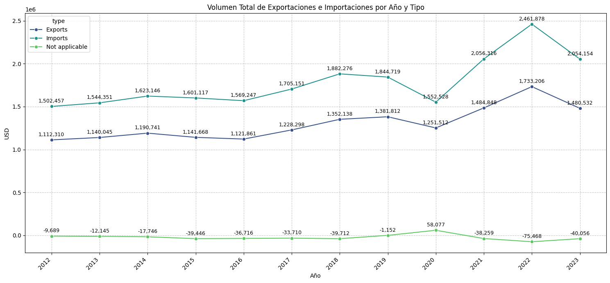


**Composición del Comercio: Conceptos Clave por Valor Acumulado**

Para comprender la estructura interna de estos flujos, se analizó el top de conceptos con mayor valor acumulado por tipo de operación (Imports, Exports, Not applicable) durante el período 2012-2023.

- **Dominio de Importaciones Totales:**
   - **Los conceptos con mayor valor acumulado están ambos relacionados con las Importaciones:** ``"Total Imports CIF (Total Imports + Freight and Insurance of Imports)" encabeza la lista con $5,427,293.28 USD``. Esto indica que al considerar el costo de los bienes más el flete y el seguro, este es el rubro de mayor peso monetario.
   - **"Total Imports"** es el segundo concepto más grande. Esto resalta la magnitud general de las importaciones en el comercio.
- **Volumen Significativo de Exportaciones Totales y No Petroleras:**
   - **"Total Exports" es el tercer concepto más relevante con $5,206,323.57 USD**. Esto muestra que las exportaciones totales tienen un peso considerable en el panorama comercial.
   - **"Non Petroleum (No Petroleras)"** es el cuarto concepto. Su composición (barras azul oscuro para Imports y verde azulado para Exports) indica que tanto las importaciones como las exportaciones de productos no petroleros son sustanciales, siendo las importaciones de productos no petroleros significativamente mayores que las exportaciones de este tipo.
- **Composición por Tipo de Comercio (Color):** La coloración de las barras (azul oscuro para Imports, verde azulado para Exports, verde claro para Not applicable) permite visualizar la dominancia o combinación de flujos comerciales:
   - **"Manufacturing (Manufactura)"** es un concepto de alto valor, dominado por las importaciones, pero con una contribución notable de las exportaciones, lo que sugiere un intercambio bidireccional importante en este sector.
   - **"Intermediate Goods (Bienes Intermedios)"** es predominantemente una categoría de importaciones, lo que es común en cadenas de suministro que dependen de insumos extranjeros para la producción local.
   - **"Consumer Goods (Bienes de Consumo)"** también es mayoritariamente de importaciones.
   - **"Petroleum (Petróleo)"** tiene contribuciones tanto de importaciones como de exportaciones, siendo las exportaciones de petróleo ligeramente mayores en este caso acumulado.
- **Conceptos de Menor Valor (al final de la lista):** Conceptos como "Crude Oil (Petróleo Crudo)", "Agrarian (Agrario)", y "Freight and insurance of Imports" tienen valores acumulados mucho menores en comparación con los "Totales" o "Manufactura". Las categorías como "Extractive (Extractiva)" y "Other Oil (Otro Petróleo)" son aún menores.
- **Balances Comerciales Negativos:** Las categorías con valores negativos, como **"Total Trade Balance Exports Total - Imports Total CIF" con $-220,969.71 USD**, se encuentran al final de la lista. Estas categorías, con barras de color verde claro (Not applicable), muestran valores negativos, lo cual es esperado, ya que el balance comercial (exportaciones - importaciones) a menudo es negativo en una economía con más importaciones que exportaciones, y se alinea con la observación del gráfico de líneas anterior de que las importaciones superan a las exportaciones.
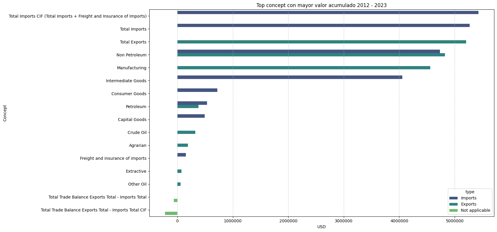

**Participación Porcentual Anual: Reafirmando el Déficit**

La proporción anual del comercio por tipo confirma la hegemonía de las importaciones y la estabilidad de la participación de las exportaciones.

- **Las Importaciones Lideran de Forma Sostenida:** A lo largo de todo el período (2012-2023), las **Importaciones (Imports % - barra naranja)** han sido el motor principal del comercio exterior, representando consistentemente **más del 57% del total anual**. Esta hegemonía subraya una economía con una alta demanda de bienes y servicios del extranjero.
- **Exportaciones: Estabilidad en la Proporción, no en el Volumen:** La participación de las **Exportaciones (Exports % - barra azul)** se ha mantenido sorprendentemente estable, oscilando alrededor del 42%-43% del comercio total cada año. Esto sugiere que, a pesar de las fluctuaciones en el volumen absoluto de exportaciones, su proporción relativa dentro del pastel comercial se ha mantenido constante.
- **La Anomalía de 2020: Un Punto de Inflexión Inesperado:** El año **2020 destaca como una excepción notable**, probablemente influenciada por la pandemia global. En contraste con la tendencia general, la participación de las **Importaciones disminuyó a su punto más bajo (54.24%)**, mientras que las **Exportaciones alcanzaron su pico (43.73%)**. Adicionalmente, la categoría "Not applicable %" (barra verde), que generalmente representa ajustes negativos, se tornó positiva (2.03%) por primera vez. Este cambio abrupto podría indicar que, durante la crisis de 2020, la caída en las importaciones fue más pronunciada que la de las exportaciones, alterando drásticamente las proporciones relativas del comercio total.
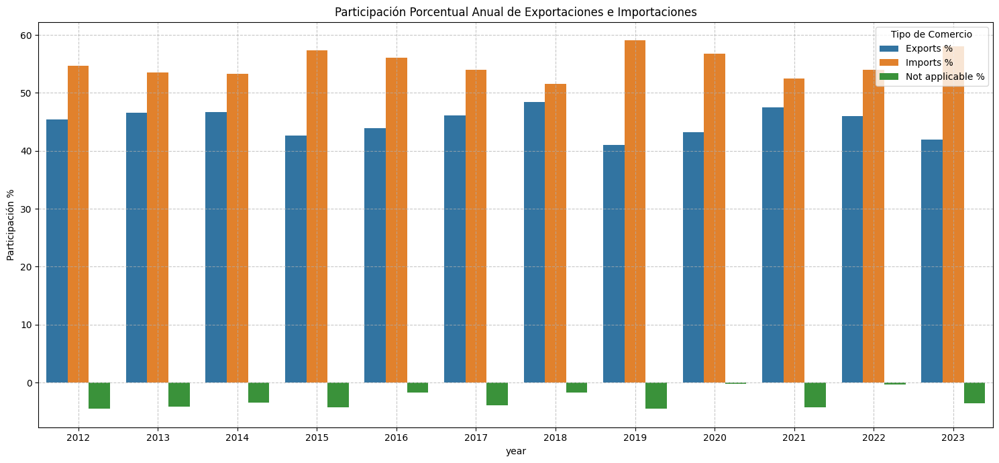

**Patrones Mensuales: Estacionalidad y el Impacto de la Pandemia**

El análisis del valor promedio mensual del comercio, visualizado en un mapa de calor, revela patrones estacionales recurrentes y el impacto disruptivo de eventos globales.

- **Crecimiento Sostenido a lo Largo de la Década:** Se observa un crecimiento constante y significativo en el valor promedio mensual del comercio a lo largo de los años. Los datos de los años más recientes (2022 y 2023) muestran consistentemente los valores más altos, destacando una expansión general en el volumen o valor del comercio. Este patrón sugiere una economía en constante expansión con un aumento en la actividad comercial global.
- **Patrones Estacionales Recurrentes:** Más allá del crecimiento anual, existen patrones estacionales o mensuales que se repiten. Ciertos meses, como **marzo (3), mayo (5), agosto (8) y octubre (10)**, tienden a mostrar consistentemente un mayor valor promedio, indicando posibles picos de actividad comercial relacionados con ciclos de producción, demanda de temporada o festividades. Por otro lado, los primeros meses del año (Enero y Febrero) y algunos meses intermedios (como Julio) a veces muestran valores ligeramente más bajos.
- **El Impacto Anómalo de 2020:** El año **2020 se destaca como una clara anomalía** en la tendencia de crecimiento. Específicamente, los meses de **Abril (4) con $9,433.74 USD y Mayo (5) con $7,466.27 USD** registraron los valores promedio más bajos de todo el período analizado, representados por colores azul oscuro muy frío. Este descenso abrupto es altamente consistente con el impacto global de la pandemia de COVID-19, que causó interrupciones masivas en las cadenas de suministro y el comercio internacional. Es alentador ver una recuperación gradual en los meses siguientes de 2020 (June en adelante), lo que demuestra la resiliencia del sector.
- **Aceleración del Crecimiento en Años Recientes (2021-2023):** Los años 2021, 2022 y especialmente 2023 han mostrado una aceleración notable en el crecimiento, con valores promedio mensuales que superan consistentemente los $16,000 - $20,000 USD. El **2023 se posiciona como el año de mayor actividad comercial** en el período estudiado, con varios meses superando la marca de los $20,000 USD (e.g., Marzo, Mayo, Agosto, Octubre). Esto subraya una fuerte recuperación y un impulso significativo en la actividad comercial en la era pospandemia.
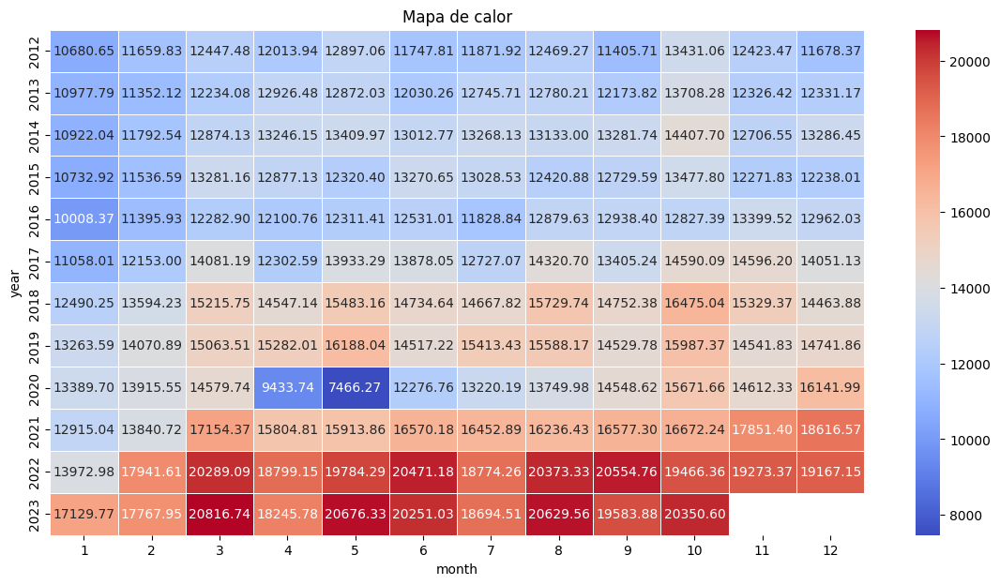

*Archivo: [Análisis Descriptivo](notebooks/3_analisis_descriptivo.ipynb)*

### **Balanza Comercial y Tendencia**
***Balance Comercial: Un Déficit Crónico y en Aumento***

Nuestro análisis del balance comercial anual entre 2012 y 2023 revela una realidad innegable: la entidad ha mantenido un déficit comercial persistente en cada uno de estos años. Esto significa que el valor de las importaciones ha superado consistentemente al de las exportaciones.

***La Magnitud y Tendencia del Déficit***

La magnitud de este déficit es considerable, oscilando entre los `-$301,016` y los `-$728,671`. Alarmantemente, hemos observado una tendencia general de incremento en el déficit desde 2012, alcanzando su punto más alto en 2022 con -$728,671.

Un punto de interés es el año 2020, que rompe esta tendencia con el déficit más bajo del período ``( -$301,016)``. Esto coincide con el inicio de la pandemia de COVID-19, sugiriendo que las importaciones pudieron haber caído más drásticamente o las exportaciones mostraron una mayor resiliencia en proporción durante ese año. Sin embargo, en 2023, aunque el déficit se redujo ligeramente respecto a 2022, se mantiene en un nivel elevado de ``-$573,622``.

***Consistencia en los Datos***

Estos hallazgos no son aislados; confirman y refuerzan las observaciones de nuestros análisis previos. Tanto los gráficos de volumen total, que muestran las importaciones consistentemente por encima de las exportaciones, como los de participación porcentual, que indican una mayor proporción de importaciones, respaldan esta interpretación de un déficit comercial crónico.

En síntesis, la entidad enfrenta una dependencia continua y creciente de las importaciones, un factor clave a considerar en su dinámica económica.
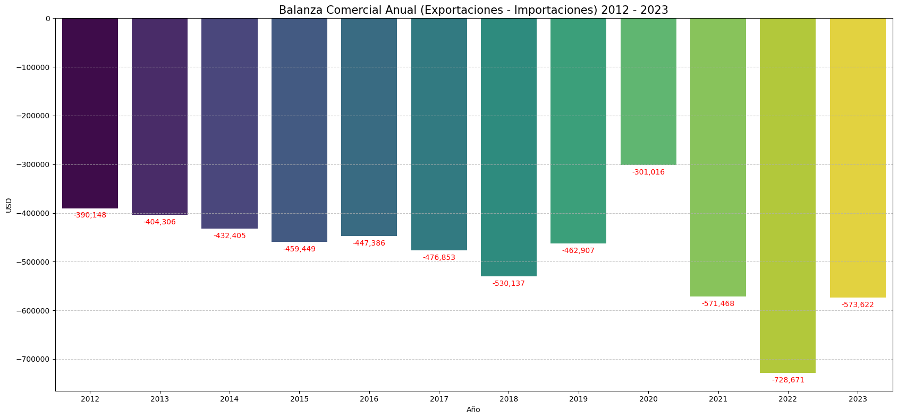

La balanza comercial de la entidad ha estado en un déficit crónico a lo largo de todo el período 2012-2023. La tendencia principal ha sido un aumento constante de este déficit, con una notable interrupción y reducción temporal en 2020 debido a la pandemia, seguida de un rápido y significativo crecimiento del déficit en 2021 y 2022, alcanzando un máximo histórico en 2022. El año 2023 muestra una ligera moderación, pero el déficit se mantiene en niveles elevados. Esta tendencia subraya una dependencia estructural de las importaciones y un desafío continuo para equilibrar el flujo comercial.
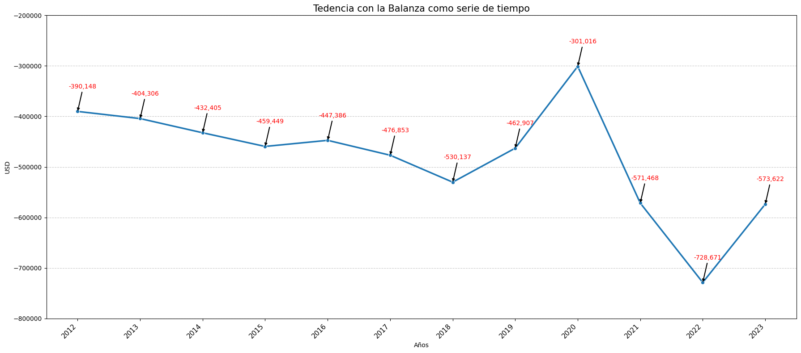

*Archivo: [Balanza Comercial y Tendencias](notebooks/4_balanza_comercial_tendencia.ipynb)*

### **Análisis Estadístico Detallado**

Esta sección profundiza en el comportamiento cuantitativo del comercio exterior de México entre 2012 y 2023, aplicando diversas técnicas estadísticas descriptivas. El objetivo es desentrañar patrones clave, evaluar la variabilidad y detectar anomalías en el valor de las transacciones, tanto a nivel anual como por tipo de operación y concepto. Este análisis sienta las bases para comprender la dinámica comercial antes de la implementación del T-MEC y para la formulación de hipótesis más sólidas.

#### **1. Evolución Anual: Crecimiento Impulsado por Transacciones de Alto Valor y Creciente Dispersión**

El análisis de la evolución anual de la media, mediana y desviación estándar del `value_usd` (valor en USD) desde 2012 a 2023 revela patrones cruciales sobre la dinámica del comercio exterior.

**Crecimiento Impulsado por Transacciones de Alto Valor**

Observamos una clara y sostenida tendencia ascendente en el valor promedio (media) de las transacciones comerciales a lo largo del periodo. Esto indica una expansión constante del volumen económico en el comercio exterior.

Sin embargo, el comportamiento de la mediana, que es consistentemente inferior a la media, sugiere un insight fundamental: la distribución de los valores de las transacciones está sesgada positivamente. Esto significa que el crecimiento del promedio es significativamente impulsado por un número relativamente pequeño de transacciones de muy alto valor, mientras que la mayoría de las operaciones se sitúan en rangos de valor inferiores. Es decir, no todas las transacciones crecen de manera uniforme, sino que algunas operaciones de gran envergadura son las que "tiran" de la media hacia arriba.

**Aumento de la Dispersión y la Complejidad del Comercio**

Paralelamente al crecimiento en los valores promedio, la desviación estándar también ha mostrado un aumento notable y sostenido a lo largo de los años. Este incremento en la dispersión nos indica que la variabilidad de los valores de las transacciones ha crecido significativamente. En términos prácticos, esto significa que la brecha entre las transacciones de menor y mayor valor se ha ampliado, haciendo que el panorama comercial sea más heterogéneo y, potencialmente, más complejo de analizar en detalle.

En los años más recientes, la desviación estándar incluso se acerca o supera el valor de la media, lo cual es una señal potente de que la dispersión es una característica dominante del comercio actual, y que las transacciones individuales pueden variar enormemente en su magnitud.

**Conclusión de la Evolución Anual:**

En síntesis, el comercio exterior de México ha experimentado un crecimiento robusto en sus valores promedio. No obstante, este crecimiento viene acompañado de una creciente asimetría en la distribución de las transacciones y una mayor variabilidad en los montos operados. Este patrón es coherente con la presencia de "outliers" (valores atípicos) que, aunque no necesariamente errores, ejercen una influencia significativa en las estadísticas agregadas y reflejan una mayor disparidad en las operaciones comerciales a lo largo del tiempo.


#### **2. Análisis por Tipo de Operación: Disparidad y Variabilidad en los Flujos Comerciales**

El análisis desagregado de las medidas estadísticas (media, mediana y desviación estándar) por tipo de operación ('Exports', 'Imports' y 'Not applicable') revela características distintivas para cada componente del comercio exterior.

**Exportaciones: Impulsadas por Pocas Transacciones de Gran Volumen**

Las exportaciones muestran una marcada asimetría positiva. Si bien su media se sitúa en un rango moderado (alrededor de 13,000-14,000 USD), la mediana es sustancialmente menor (aproximadamente 2,000 USD). Este patrón sugiere que el valor promedio de las exportaciones es fuertemente influenciado por un número limitado de transacciones de muy alto valor, mientras que la mayoría de las operaciones de exportación son de menor cuantía. La elevada desviación estándar (más de 16,000 USD) refuerza esta idea, indicando una alta dispersión y heterogeneidad en los montos de las exportaciones.

**Importaciones: Mayor Valor Promedio y Dispersión Similar a Exportaciones**

Las importaciones presentan, en promedio, un valor significativamente más alto que las exportaciones, con una media cercana a los 18,000 USD y una mediana también más elevada (alrededor de 12,500 USD). Aunque persiste una asimetría, la brecha entre la media y la mediana es comparativamente menor, lo que podría indicar una distribución de valores con un "piso" más alto en las importaciones. Curiosamente, la desviación estándar de las importaciones es muy similar a la de las exportaciones (ligeramente por encima de 16,000 USD), lo que implica que ambos flujos comerciales exhiben una considerable variabilidad en sus montos.

**"No Aplicable" (Balanza Comercial): Fluctuación Alrededor del Equilibrio**

La categoría "Not applicable", que representa principalmente la balanza comercial, se caracteriza por tener una media y mediana cercanas a cero (o incluso ligeramente negativas). Esto es coherente con su naturaleza de reflejar déficits o superávits que promedian alrededor de un punto de equilibrio. Sin embargo, a pesar de sus valores centrales bajos, la desviación estándar es considerable (alrededor de 2,500 USD). Este insight es crucial: indica que, aunque el promedio esté cerca de cero, la balanza comercial experimenta fluctuaciones significativas, oscilando entre periodos de déficit y superávit de magnitudes variadas.

**Conclusión por Tipo de Operación:**

En resumen, este análisis por tipo de operación subraya que, si bien las importaciones manejan en promedio valores más altos que las exportaciones, ambos flujos presentan una alta variabilidad, impulsados por transacciones de gran magnitud que elevan sus promedios. Por otro lado, la balanza comercial ("Not applicable") muestra una tendencia a promediar cerca del equilibrio, pero con una dispersión que refleja su constante oscilación entre periodos de superávit y déficit. Este panorama refuerza la imagen de un comercio exterior dinámico, con componentes de muy distinto tamaño y una variabilidad inherente en sus operaciones.
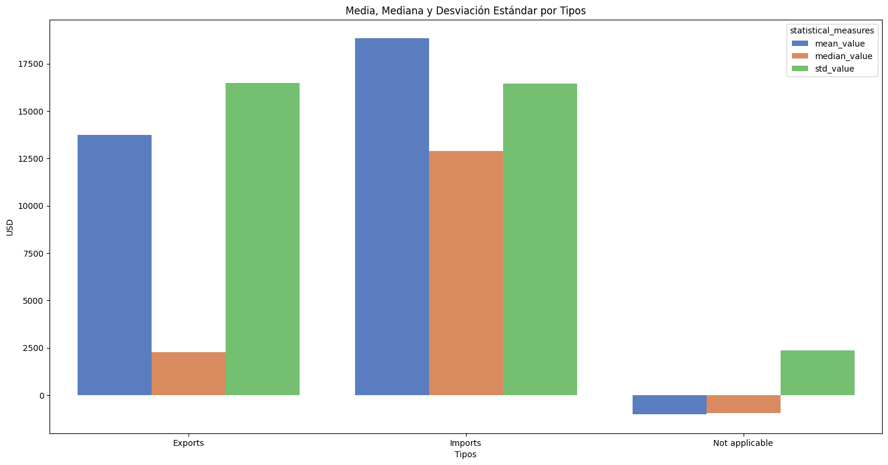

#### **3. Análisis por Concepto: Disparidad y Heterogeneidad a Nivel Granular**

El análisis granular de la media, mediana y desviación estándar por cada concepto de comercio (`concept`) revela la estructura de valor y la variabilidad inherente en los distintos segmentos del comercio exterior de México.

**Los Motores del Comercio: Altos Valores y Extrema Heterogeneidad**

Los conceptos que realmente impulsan el valor del comercio exterior de México son claramente identificables: "Manufacturing", "Non Petroleum", y los agregados de "Total Exports", "Total Imports", y "Total Imports CIF". Estas categorías no solo exhiben las medias más altas, indicando su preponderancia en el valor promedio de las transacciones, sino que también presentan una brecha considerable entre la media y la mediana. Este patrón subraya que, dentro de estos segmentos críticos, un número limitado de transacciones de muy alto valor son las que elevan significativamente el promedio, mientras que la mayoría de las operaciones son de menor magnitud.

Aunado a esto, la desviación estándar es notablemente alta para estos conceptos, superando con frecuencia el valor de la mediana. Esto es un insight fundamental: no solo estamos hablando de grandes volúmenes, sino de una extrema variabilidad en los montos de las transacciones dentro de estas categorías, reflejando una amplia gama de tamaños de operaciones que van desde pequeñas a gigantescas.

**Balanza Comercial: Déficit Promedio con Amplia Oscilación**

Los conceptos relacionados con la balanza comercial ("Total Trade Balance Exports Total - Imports Total" y "Total Trade Balance Exports Total - Imports Total CIF") se distinguen por tener medias y medianas cercanas a cero, o incluso negativas, confirmando la tendencia de un déficit comercial promedio para México en el periodo.

Sin embargo, el insight más relevante aquí es la notable desviación estándar para estas categorías. A pesar de los promedios bajos, la dispersión es significativamente mayor que la media o mediana en valor absoluto. Esto implica que, aunque el balance general se incline hacia el déficit, existe una gran volatilidad en la balanza comercial mensual, con oscilaciones considerables entre períodos de déficit y, ocasionalmente, superávit. Esta variabilidad subraya la inestabilidad inherente de este indicador económico.

**Segmentos Intermedios y de Menor Impacto**
Los conceptos de volumen intermedio, como "Intermediate Goods", "Capital Goods", "Petroleum" y "Consumer Goods", también muestran asimetría y variabilidad, pero en una escala reducida en comparación con los motores principales. Por otro lado, las categorías de bajo volumen como "Agrarian", "Crude Oil", "Extractive", "Freight and insurance of imports", y "Other Oil" exhiben medias, medianas y desviaciones estándar notablemente menores, indicando operaciones de menor magnitud y con menos variabilidad.

**Conclusión General por Concepto:**

Este análisis granular confirma que el comercio exterior de México está dominado en valor por un puñado de categorías agregadas y la manufactura, las cuales no solo son las más significativas en volumen, sino que también son altamente heterogéneas, impulsadas por transacciones excepcionales. Paralelamente, la balanza comercial, si bien promedia un déficit, se caracteriza por una amplia variabilidad que refleja su constante oscilación. Comprender estas disparidades es crucial para estrategias comerciales más focalizadas.
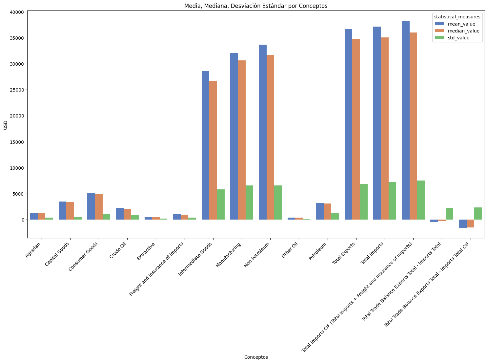

#### **4. Variabilidad Anual Comparada: Tendencia Creciente en la Volatilidad del Comercio Exterior**

El análisis comparativo de las varianzas anuales entre exportaciones e importaciones revela una tendencia clara y significativa: la dispersión en el valor de las transacciones comerciales ha aumentado considerablemente a lo largo del período 2012-2023.

**Incremento Generalizado de la Varianza**

Tanto para las exportaciones como para las importaciones, se observa una clara tendencia ascendente en la varianza año tras año. Esto significa que la volatilidad o la amplitud de los valores de las transacciones se ha incrementado significativamente con el tiempo. Las varianzas alcanzan sus picos en los años más recientes (2021, 2022 y 2023), superando los 450,000,000 USD$^2$, lo que indica que el comercio se ha vuelto más impredecible en términos de la magnitud de los montos transaccionados. Este hallazgo es coherente con las observaciones previas sobre el aumento de la desviación estándar en los análisis anuales.

**Convergencia en la Variabilidad entre Exportaciones e Importaciones**

Un insight crucial surge al comparar la varianza entre ambos tipos de operaciones. Aunque visualmente las varianzas de exportaciones e importaciones parecen similares en la mayoría de los años, las pruebas estadísticas de Levene ofrecen una visión más matizada:

* **Diferencia Inicial (2012-2013):** Para 2012 y 2013, las varianzas de exportaciones e importaciones fueron estadísticamente diferentes. Esto sugiere que, en los primeros años del período, la dispersión de los montos de exportación no se comportaba de la misma manera que la de importación.
* **Convergencia Posterior (2014-2023):** Sin embargo, a partir de 2014 y hasta el final del período analizado, no hay evidencia estadística para afirmar que las varianzas entre exportaciones e importaciones sean significativamente diferentes. Esto implica que, a medida que el comercio ha crecido y evolucionado, la dispersión de los montos transaccionados se ha vuelto similar para ambos tipos de operaciones.

**Conclusión de la Variabilidad Anual:**

En resumen, el comercio exterior de México se ha caracterizado por una creciente volatilidad en los montos de sus transacciones. Además, mientras que al inicio del período hubo diferencias en la variabilidad entre exportaciones e importaciones, esta disparidad se ha disipado, indicando que ambos flujos comerciales ahora exhiben una dispersión similar en sus valores a medida que maduran y se expanden. Comprender esta creciente y uniformizada volatilidad es clave para la gestión de riesgos y la planificación estratégica en el sector comercial.
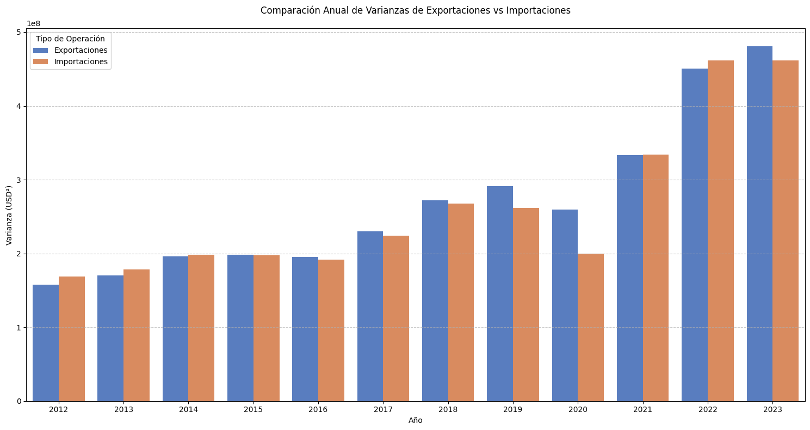

#### **5. Distribución de Valores: Crecimiento Asimétrico y Mayor Amplitud con Outliers Válidos**

El gráfico de caja (boxplot) del valor en USD por año y tipo de operación ofrece una visión detallada de la distribución, la tendencia central y la variabilidad, consolidando las observaciones previas y revelando patrones clave en la dinámica comercial de México.

**Exportaciones e Importaciones: Crecimiento Asimétrico y Mayor Amplitud**

Los boxplots de Exportaciones (azul) e Importaciones (naranja) confirman visualmente las tendencias observadas anteriormente:

* **Crecimiento en los Valores Centrales y Rango:** Las cajas y las medianas muestran una clara tendencia ascendente a lo largo de los años. Esto no solo valida el incremento en los valores promedio, sino que también indica que la mayor concentración de transacciones se ha movido hacia montos más altos con el tiempo.
* **Asimetría Marcada (Sesgo Positivo):** Una característica prominente es la marcada asimetría positiva en la distribución de ambos tipos de operaciones. La mediana, casi siempre más cercana al cuartil inferior, y los bigotes superiores notablemente más largos, sugieren que la mayoría de las transacciones son de menor valor, pero un subconjunto de operaciones de muy alto valor son las que "estiran" la distribución hacia arriba, influyendo fuertemente en la media.
* **Aumento de la Variabilidad:** La creciente amplitud de las cajas y la extensión de los bigotes, especialmente en los años más recientes (2020-2023), junto con la dispersión de los puntos atípicos, refuerzan la conclusión de una variabilidad creciente en los montos de las transacciones de exportación e importación.
* **Ligeras Diferencias en el Rango Superior:** Aunque hay superposición en los rangos, las cajas de importaciones tienden a posicionarse ligeramente por encima o a tener cuartiles superiores más elevados en muchos años, lo que indica que las importaciones a menudo involucran valores máximos de transacción más altos.

**"No Aplicable" (Balanza Comercial): Balance Cercano a Cero con Eventos Extremos**

Para la categoría "Not applicable" (verde), que representa la balanza comercial, los boxplots revelan:

* **Valores Centrales Alrededor de Cero o Negativos:** Las cajas y medianas se mantienen consistentemente alrededor de cero o en valores negativos, lo cual es coherente con su naturaleza de reflejar saldos que pueden ser superávits (positivos) o déficits (negativos) a lo largo del tiempo.
* **Dispersión Significativa:** A pesar de los valores centrales bajos, los bigotes y los outliers muestran una dispersión considerable. Esto subraya la fluctuación inherente en la balanza comercial, con meses que registran tanto déficits notables (valores negativos) como, en menor medida, superávits (valores positivos).
* **Outliers Relevantes:** La presencia de outliers tanto positivos como negativos en esta categoría es crucial. Como se confirmó en la preparación de datos, estos no son errores, sino reflejos de meses con superávits o déficits comerciales de magnitud inusual, aportando información vital para el análisis económico de eventos extremos.

**Conclusión de la Distribución de Valores:**

Este boxplot proporciona una visión robusta y granular de la evolución del valor del comercio exterior. Confirma la tendencia de crecimiento en los valores centrales de exportaciones e importaciones, la marcada asimetría positiva en sus distribuciones, y una variabilidad creciente con el tiempo. Además, subraya la naturaleza oscilatoria de la balanza comercial alrededor de cero o en déficit, con eventos de grandes déficits o superávits que son válidos y esenciales para el análisis. La decisión de mantener estos "outliers" valida la representación real de la magnitud y la dinámica del comercio exterior de México.
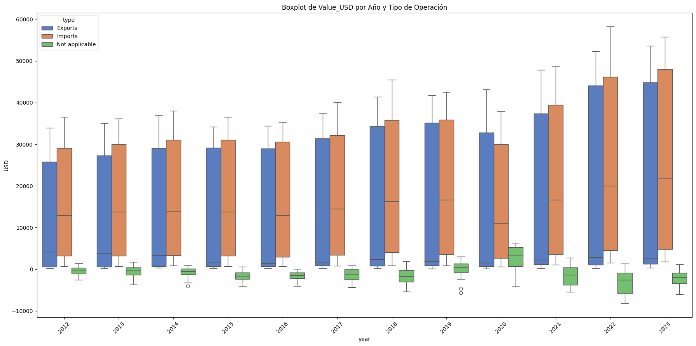

*Archivo: [Análisis Estadístico](notebooks/5_analisis_estadistico.ipynb)*
<!-- #### **Conclusión General del Análisis Estadístico**

Este análisis estadístico descriptivo ha proporcionado una comprensión cuantitativa profunda del comportamiento del comercio exterior de México entre 2012 y 2023. Se han identificado patrones claros de crecimiento en el valor promedio de las transacciones, acompañado de una creciente asimetría en la distribución (influencia de transacciones de alto valor) y una notable variabilidad en los montos. Se ha confirmado la naturaleza fluctuante de la balanza comercial, que tiende al déficit pero con oscilaciones significativas.

Los hallazgos de esta fase, complementados por las visualizaciones detalladas, establecen una línea base robusta del comportamiento comercial y serán fundamentales para las fases posteriores del análisis, como la evaluación del impacto de eventos específicos o la formulación de modelos predictivos. -->

### **Análisis de Impacto Post-T-MEC**

Para evaluar el impacto potencial del Tratado entre México, Estados Unidos y Canadá (T-MEC), se dividió el conjunto de datos en dos periodos:
```Bash
Número de registros Pre-T-MEC (2012-2019): 1728
Número de registros Post-T-MEC (2020-2023): 828
```
Se realizó una comparación inicial de las medias del valor en USD para exportaciones e importaciones en ambos periodos:
```Bash
Medias de Value_USD (Pre-T-MEC):
  Exportaciones: 12,589.68
  Importaciones: 17,281.85

Medias de Value_USD (Post-T-MEC):
  Exportaciones: 16,168.75
  Importaciones: 22,078.47
```
**El T-MEC y el Aumento del Flujo Comercial en México**

Nuestro análisis comparativo de los periodos pre y post-T-MEC revela un claro incremento en el valor promedio mensual tanto de las exportaciones como de las importaciones en México. Este aumento sugiere una dinamización del comercio exterior tras la entrada en vigor del tratado.

**Crecimiento de Exportaciones e Importaciones**

Antes del T-MEC (2012-2019), el promedio mensual de las exportaciones era de $12,589.68. Post-T-MEC (2020-2023), esta cifra ascendió a $16,168.75, lo que representa un incremento de $3,579.07 (aproximadamente un 28.49%).

Por su parte, las importaciones también mostraron un alza significativa. De una media de $17,281.85 en el periodo pre-T-MEC, pasaron a $22,078.47 en el periodo post-T-MEC, un aumento de $4,796.62 (cerca del 27.75%).

**Un Aumento Absoluto Mayor en Importaciones**

Si bien ambos rubros experimentaron un crecimiento porcentual similar, es importante destacar que el incremento absoluto en el valor promedio mensual de las importaciones fue mayor ($4,796.62) que el de las exportaciones ($3,579.07). Esto sugiere que, si bien el T-MEC impulsó ambos lados de la balanza comercial, el crecimiento en el flujo de entrada de bienes fue marginalmente más pronunciado.

**Prueba de Hipótesis: Confirmación Estadística del Impacto del T-MEC**

Para determinar si estos incrementos observados en las medias son estadísticamente significativos y no producto del azar, se procedió a realizar pruebas de hipótesis para exportaciones e importaciones, formulando las siguientes:

* **H0 (Hipótesis Nula):** No hay diferencia significativa en el valor medio antes y después del T-MEC.
* **H1 (Hipótesis Alterna):** Sí hay una diferencia significativa en el valor medio antes y después del T-MEC.
Se realizaron pruebas de normalidad (Shapiro-Wilk) y de homogeneidad de varianzas (Levene) para determinar la prueba paramétrica o no paramétrica más adecuada.

```Bash
--- Comparación para EXPORTACIONES ---
  Prueba de Levene (Exportaciones): Estadístico=11.9396, p-valor=0.0006
  -> Las varianzas de Exportaciones son significativamente diferentes.
  Normalidad Exportaciones Pre-T-MEC (Shapiro): p-valor=0.0000
  Normalidad Exportaciones Post-T-MEC (Shapiro): p-valor=0.0000
  -> Al menos un grupo de Exportaciones NO parece seguir una distribución normal.
  Mann-Whitney U (Exportaciones): Estadístico=120006.0000, p-valor=0.0000
  CONCLUSIÓN: Rechazamos H0. Hay una diferencia significativa en la media de Exportaciones entre los periodos Pre-T-MEC y Post-T-MEC.

--- Comparación para IMPORTACIONES ---
  Prueba de Levene (Importaciones): Estadístico=70.0658, p-valor=0.0000
  -> Las varianzas de Importaciones son significativamente diferentes.
  Normalidad Importaciones Pre-T-MEC (Shapiro): p-valor=0.0000
  Normalidad Importaciones Post-T-MEC (Shapiro): p-valor=0.0000
  -> Al menos un grupo de Importaciones NO parece seguir una distribución normal.
  Mann-Whitney U (Importaciones): Estadístico=113607.0000, p-valor=0.0000
  CONCLUSIÓN: Rechazamos H0. Hay una diferencia significativa en la media de Importaciones entre los periodos Pre-T-MEC y Post-T-MEC.
```

**El T-MEC Impulsó Significativamente el Comercio Mexicano**

Nuestro análisis estadístico confirma lo que las cifras iniciales sugerían: la entrada en vigor del T-MEC, y el período subsiguiente, marcó un cambio estadísticamente significativo en el valor promedio tanto de las exportaciones como de las importaciones en México. Esto significa que los incrementos observados en el comercio no son producto del azar, sino que reflejan una verdadera transformación en la dinámica comercial del país.

**Impacto Confirmado en Exportaciones**

Las pruebas realizadas para las exportaciones demuestran contundentemente que hay una diferencia significativa en el valor promedio entre el período Pre-T-MEC y Post-T-MEC. Las varianzas entre ambos periodos son distintas y los datos no siguen una distribución normal, lo que validó la elección de la prueba no paramétrica Mann-Whitney U. El p-valor extremadamente bajo nos permite rechazar la hipótesis nula, reforzando que el aumento de $12,589.68 a $16,168.75 en la media de las exportaciones es un cambio real y sustancial.

**Crecimiento Confirmado en Importaciones**

De manera similar, las importaciones también muestran una diferencia estadísticamente significativa en su valor promedio entre ambos períodos. Al igual que con las exportaciones, las varianzas son diferentes y los datos no se distribuyen normalmente, haciendo de la prueba Mann-Whitney U la herramienta adecuada. El p-valor igualmente bajo nos permite rechazar la hipótesis nula, confirmando que el incremento de $17,281.85 a $22,078.47 en la media de las importaciones es un cambio genuino.

**Consideraciones Clave del Análisis**

Es crucial destacar la robustez de estas conclusiones gracias a la correcta elección de las pruebas estadísticas. La identificación de varianzas significativamente diferentes y la falta de normalidad en la distribución de los datos justificaron la aplicación de la prueba no paramétrica de Mann-Whitney U, asegurando la validez de nuestras inferencias.

En resumen, los resultados no solo muestran un aumento en el comercio post-T-MEC, sino que lo validan estadísticamente, indicando que este nuevo tratado y los factores asociados a su implementación (incluyendo, posiblemente, la adaptación a los cambios globales derivados de la pandemia) han tenido un impacto real y medible en el incremento del valor promedio de las transacciones comerciales de México, tanto de entrada como de salida.
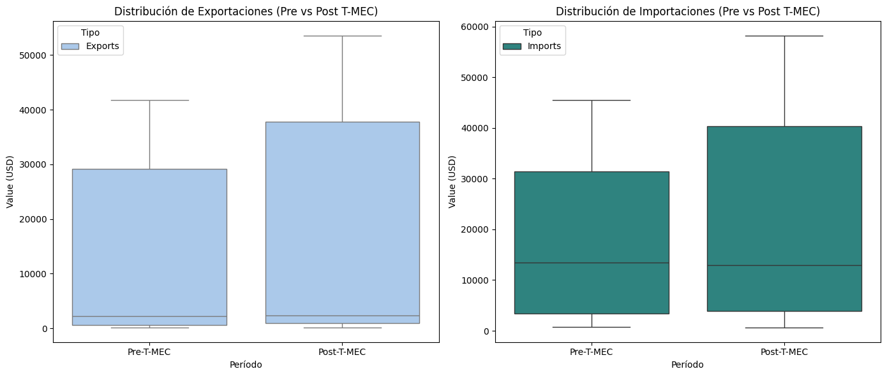

**Visualizando el Impacto del T-MEC en Exportaciones e Importaciones**

Los gráficos de caja (boxplots) confirman visualmente las conclusiones estadísticas previas, mostrando una clara diferencia en la distribución de los valores de exportaciones e importaciones entre el período Pre-T-MEC y Post-T-MEC.

**Exportaciones: Un Salto Cuantitativo Post-T-MEC**

El boxplot de Exportaciones ilustra un aumento notable en el valor:

* ***Pre-T-MEC:*** La caja es más compacta y se sitúa en un rango de valores más bajos, con una mediana que indica que la mayoría de las exportaciones se concentraban en valores menores.
* ***Post-T-MEC:*** La caja se desplaza significativamente hacia arriba y es considerablemente más grande. Esto sugiere no solo un aumento en la mediana (valor central) de las exportaciones, sino también una mayor variabilidad o dispersión en los valores, reforzando la idea de un incremento generalizado en el valor de las exportaciones post-T-MEC.

**Importaciones: Crecimiento y Mayor Amplitud**

El boxplot de Importaciones refleja un patrón similar de crecimiento:

* ***Pre-T-MEC:*** La caja se encuentra en un rango intermedio, con una mediana ya más alta que la de las exportaciones en el mismo período.
* ***Post-T-MEC:*** Al igual que con las exportaciones, la caja de las importaciones se desplaza visiblemente hacia arriba, indicando un aumento en su mediana y en el rango de valores. La mayor altura de la caja también sugiere una mayor dispersión en los valores de importación después del T-MEC.

**Conclusión Visual**

En conjunto, estos gráficos de caja ofrecen una evidencia visual contundente que corrobora las conclusiones estadísticas: tanto las exportaciones como las importaciones experimentaron un claro incremento en sus valores centrales y rango en el período posterior a la implementación del T-MEC. La mayor amplitud de las cajas también sugiere un aumento en la variabilidad, haciendo tangibles los cambios significativos detectados por las pruebas de hipótesis en la distribución de los datos.

*Archivo: [Análisis de Impacto POST-T-MEC](notebooks/6_analisis_impacto_post_t_mec.ipynb)*

---

## 📈 Conclusiones y Recomendaciones

- [Insight 1]
- [Insight 2]
- [Recomendación práctica o estratégica basada en los datos]

---

## 🛠️ Tecnologías

- Python
- Pandas
- Matplotlib
- Seaborn
- Jupyter Notebook / Google Colab
- [Otras herramientas que uses, como Scikit-learn, Plotly, etc.]

---

## ⚙️ Instalación

### 1. Clonar este repositorio:
```bash
git clone https://github.com/tu_usuario/nombre_del_proyecto.git
```
### 2. Uso de un Entorno Virtual para Aislar Dependencias

Para evitar conflictos con versiones de librerías, se recomienda usar entornos virtuales.

####  Crear y Activar un Entorno Virtual

##### Crear el entorno virtual:
```
python -m venv venv
```
##### Activar el entorno:
* #### En Windows:

    ```
    venv\Scripts\activate
    ```

* #### En Mac/Linux::

    ```
    source venv/bin/activate
    ```
#### 3. Instalar dependencias dentro del entorno:
* #### Opición 1:
    ```
    pip install -r requirements.txt
    ```

* #### Opción 2 (De forma manual):
    ```
    pip install numpy pandas matplotlib seaborn scikit-learn
    ```
---

## 👤 Autor

**Said Mariano Sánchez** – *smariano170@gmail.com*  
Este proyecto forma parte de mi portafolio como analista de datos Jr.

---

## 📝 Licencia

Este proyecto está licenciado bajo la **Licencia MIT**. Puedes usarlo, modificarlo y distribuirlo libremente, siempre que menciones al autor original.

---